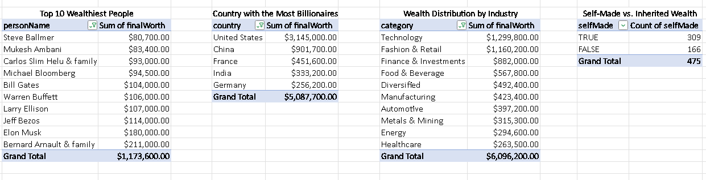
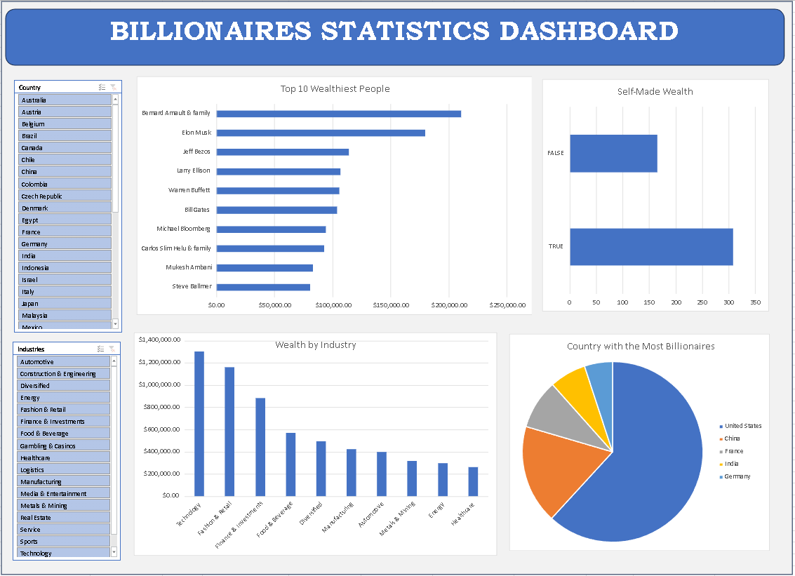

# **Billionaires Statistics Analysis**  

## **Project Overview**  
This project analyzes global billionaire statistics, examining wealth distribution, industry trends, and self-made vs. inherited wealth patterns. The goal is to provide insights into how wealth is accumulated and distributed across different sectors and regions.  

**Dataset Source & Credits:** [Billionaires Statistics Dataset - Kenji Explains](https://www.youtube.com/watch?v=aUMEx4in2iU)  

---

## **Objectives**  
- Identify the **top 10 wealthiest people** and their net worth.  
- Determine which **country has the most billionaires** based on total wealth.  
- Analyze **wealth distribution across industries** to see which sectors dominate billionaire wealth.  
- Compare **self-made vs. inherited wealth** to understand different wealth accumulation paths.  

---

## **Project Structure**  
 **Data Cleaning & Preprocessing**  
- Converted `finalWorth` values into numerical format.  
- Standardized industry and country names.  
- Ensured binary classification (`TRUE/FALSE`) for `selfMade` column.  

 **Data Analysis**  

### **Top 10 Wealthiest People**  
- **Bernard Arnault & family** leads with **$211B**, followed by **Elon Musk** ($180B) and **Jeff Bezos** ($114B).  
- The **total wealth of the top 10 billionaires is $1.17T**.  

### **Country with the Most Billionaires**  
- **United States** dominates with **$3.14T** in billionaire wealth.  
- **China** follows with **$901.7B**, while **France, India, and Germany** also contribute significantly.  

### **Wealth Distribution by Industry**  
- **Technology** is the most lucrative industry, housing **$1.3T** in billionaire wealth.  
- **Fashion & Retail** ($1.16T) and **Finance & Investments** ($882B) also rank high.  
- **Industries like Energy, Healthcare, and Mining** contribute comparatively lower amounts.  

### **Self-Made vs. Inherited Wealth**  
- **309 billionaires (65%) are self-made**, showing entrepreneurship plays a crucial role.  
- **166 billionaires (35%) inherited their wealth**, indicating generational wealth transfer still holds significance.  

 **Data Visualization**

---

## **Conclusion**  
- The **United States** remains the global hub for billionaire wealth.  
- **Technology, Fashion, and Finance** are the most dominant wealth-generating industries.  
- **Self-made billionaires** outnumber those who inherited wealth, emphasizing the power of entrepreneurship and business innovation.  

---

## **Author**  
[Engr. Kurt Avery Santos](https://github.com/KurtAvery25)  

